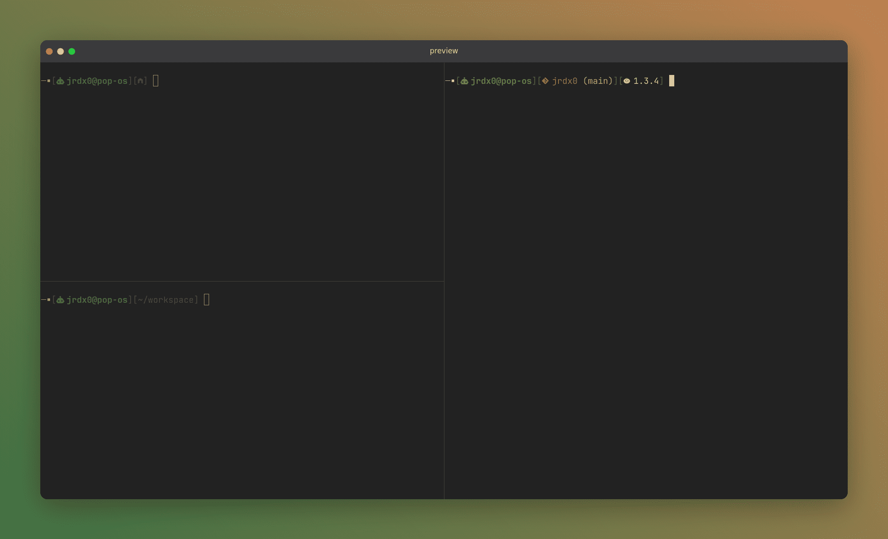

# MAUKAN THEME

"Maukan" is an (Oh My Bash)[https://ohmybash.nntoan.com/] theme inspired by (Mairan)[https://github.com/ohmybash/oh-my-bash/tree/master/themes/mairan]. For a better visual result, install (miasma theme)[https://github.com/xero/miasma.nvim] and (Nerd Font)[https://www.nerdfonts.com/] in your terminal.



## Install

Clone the repository in the theme directory of Oh My Bash (normally `~/.oh-my-bash/themes`)

```bash
git clone https://github.com/jrdx0/maukan.theme.git ~/.oh-my-bash/themes/maukan
```

Update your `.bashrc` file adding the theme

```bash
OSH_THEME="maukan"
```
